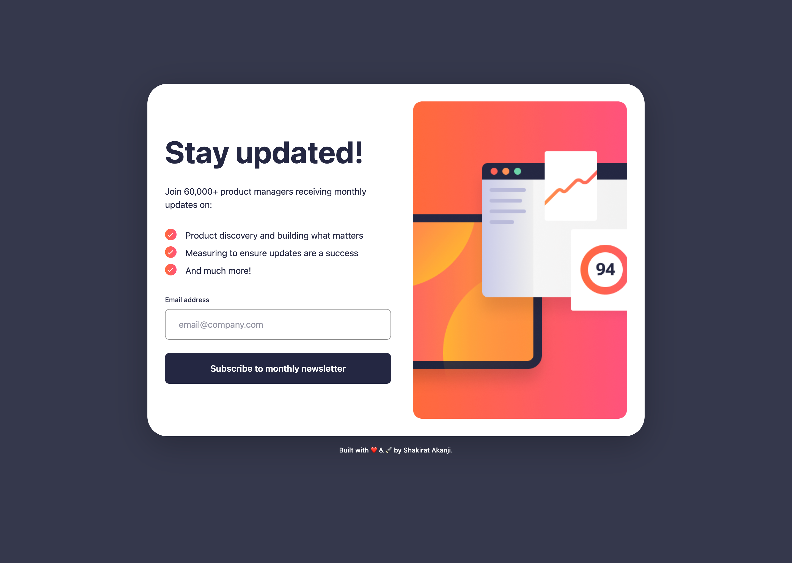
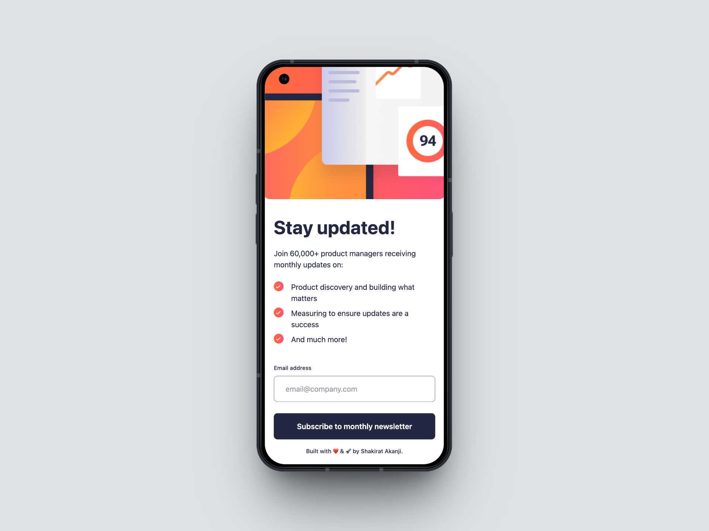
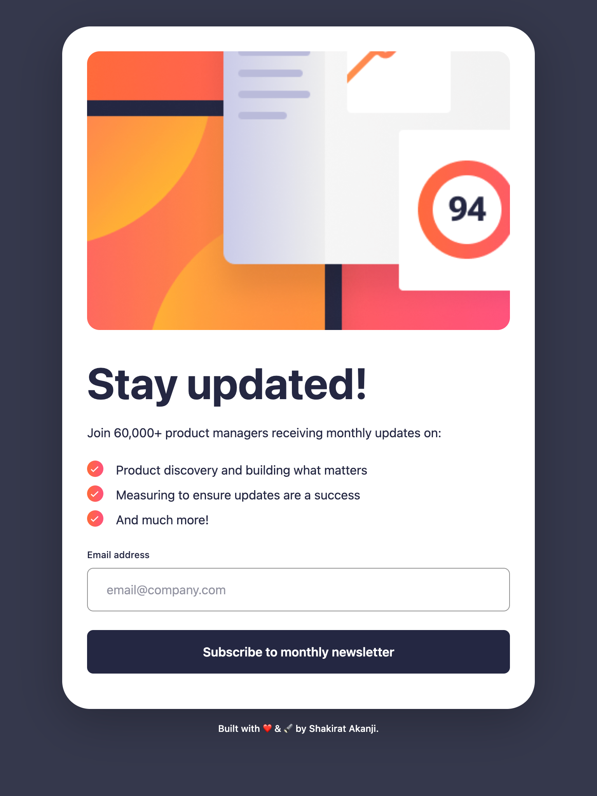

# Newsletter Sign-Up Form

A responsive, interactive newsletter sign-up form built with **React** and **TailwindCSS**. Users can enter their email address, see real-time validation, and receive a success confirmation message.

This project is a solution to the [Frontend Mentor Newsletter Sign-Up Form Challenge](https://www.frontendmentor.io/challenges/newsletter-signup-form-with-success-message-3FC1AZbNrv).

---

## 📌 The Challenge

Users should be able to:

- Enter their email address and submit the form.
- See a success message with their email after submitting.
- View form validation messages if:
  - The field is empty.
  - The email address is not correctly formatted.
- Experience responsive layouts optimized for any device.
- See hover and focus states for interactive elements.

---

## ✨ Features

- ✅ Email input with real-time validation
- ✅ Error messages for empty/invalid emails
- ✅ Success screen displaying user’s submitted email
- ✅ Fully responsive layout for mobile & desktop
- ✅ Smooth hover/focus states for improved UX

---

## 🚀 Demo

- **Live Site:** [Newsletter Form on Vercel](https://newsletter-form-tau.vercel.app/)
- **Solution:** [Frontend Mentor Submission](https://www.frontendmentor.io/solutions/newsletter-signup-form-with-success-message-3FC1AZbNrv)







---

## 🛠️ Built With

- [React](https://reactjs.org/)
- [TailwindCSS](https://tailwindcss.com/)
- JavaScript (ES6+)
- [Vite](https://vitejs.dev/)

---

## 📂 Project Structure

```bash
Newsletter-Form/
│── public/           # Static assets
│── src/
│   ├── components/   # Reusable UI components
│   ├── App.jsx       # Main app container
│   ├── index.css     # Tailwind base styles
│   └── main.jsx      # Entry point
│── package.json
│── tailwind.config.js
│── vite.config.js
└── README.md
```

## 🧑‍💻 Getting Started

### Prerequisites

- [Node.js](https://nodejs.org/) (v14 or later)
- [npm](https://www.npmjs.com/) or [Yarn](https://yarnpkg.com/)

### Installation

1. **Clone the repository:**

   ```bash
   git clone https://github.com/Anikhe00/newsletter-form.git
   cd newsletter-form
   ```

2. **Install dependencies:**

   ```bash
   npm install
   # or
   yarn install
   ```

3. **Run the development server:**

   ```bash
   npm run dev
   # or
   yarn dev
   ```

   The app will be available at `http://localhost:3000`.

---

## Learning Objectives

Through this project, I learned how to:

- Handle form state and validation using React state.
- Implement conditional rendering for success and error states.
- Apply responsive design principles using TailwindCSS.
- Create a smooth user experience with hover and focus states.

---

## Future Improvements

- Add server-side validation for email submissions.
- Implement a subscription backend to store user emails.
- Add a newsletter sign-up confirmation email.
- Enhance accessibility features.

---

## Author

- **Name** - Shakirat Akanji
- **Github** - [Anikhe00](https://github.com/Anikhe00)
- **LinkedIn** - [Shakirat Akanji](https://www.linkedin.com/in/shakirat-akanji/)
- **Frontend Mentor** - [Anikhe00](https://www.frontendmentor.io/profile/Anikhe00)
